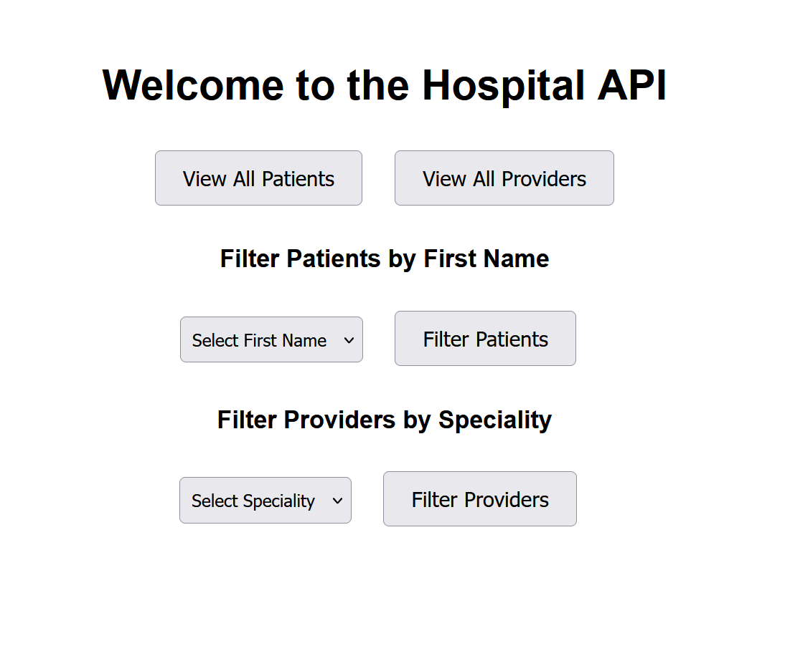

# Patient and Provider Management API

This application provides a simple API for managing patients and providers in a healthcare setting. Built with Node.js, Express, and MySQL, it allows users to retrieve and filter patient and provider information.

## Application Interface

The interface of the MediConnect application allows users to navigate easily and interact with patient and provider records.

## Table of Contents

- [Features](#features)
- [Technologies](#technologies)
- [Installation](#installation)
- [Usage](#usage)
- [API Endpoints](#api-endpoints)
- [License](#license)

## Features

- Retrieve all patients and providers
- Filter patients by first name
- Filter providers by speciality
- Dynamic dropdowns for filtering options
- User-friendly interface with EJS templating

## Technologies

- Node.js
- Express
- MySQL
- EJS
- dotenv
- mysql2

## Installation

1. **Clone the repository**:
   
   git clone https://github.com/PLP-Database-Design/week-5-assignment-OumaCavin.git
   
   cd MediConnect

2. **Install dependencies:**

   npm install

3. **Set up your environment:**

    Create a .env file in the root directory of your project with the following content:

 
    DB_USERNAME=root
    DB_HOST=localhost
    DB_PASSWORD=your_password
    DB_NAME=hospital_db
    PORT=3000

4. **Start the server:**

bash

    npm start

## Usage

Open your web browser and navigate to http://localhost:3000 to access the application. Use the interface to filter patients and providers.

## License

This project is licensed under the MIT License - see the LICENSE file for details.

